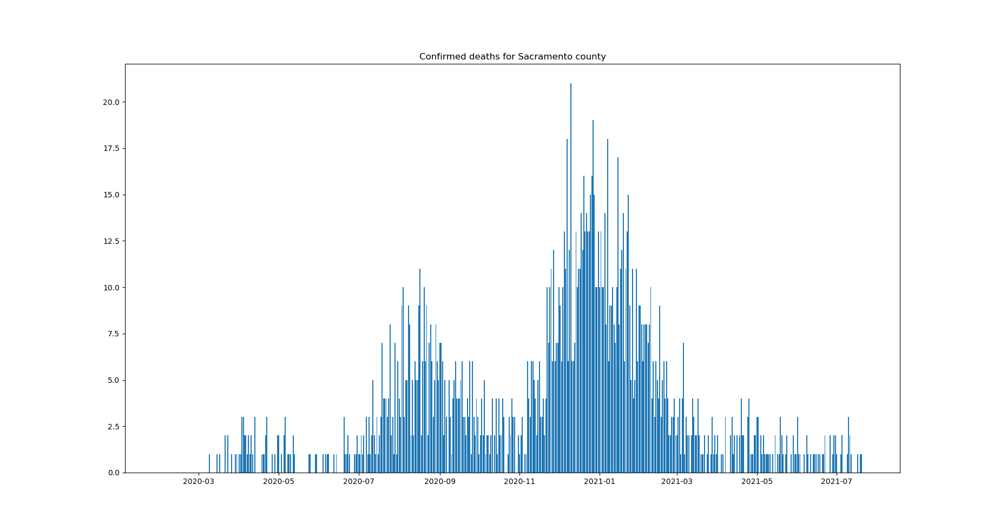
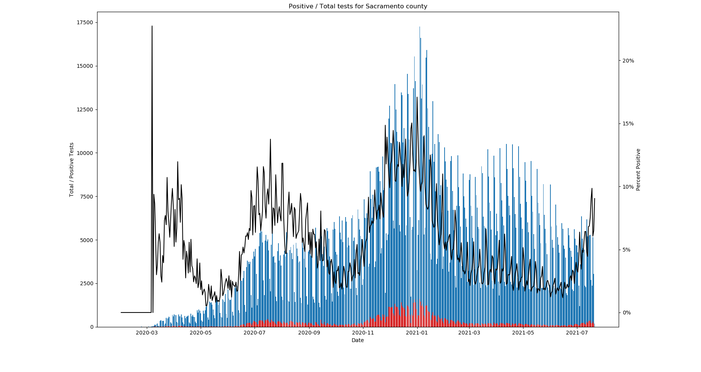

# California COVID-19 Data

This script uses matplotlib to graph confirmed COVID-19 cases, deaths, and test positivity for any California county.

### Data sources
The cases data comes from the CA Health and Human Services Data Portal

### Requirements
- python 3
- matplotlib

### Usage
```
# specify the county you want to plot data for
# look up the available county names in `covid19cases_test.csv`
$ python cases_plot.py "Sacramento"
```


```
$ python deaths_plot.py "Sacramento"
```



```
$ python tests_plot.py "Sacramento"
```



### Updating the data
You can update the data by downloading a new CSV file from https://data.chhs.ca.gov/dataset/covid-19-time-series-metrics-by-county-and-state and replacing the `covid19cases_test.csv` file.
