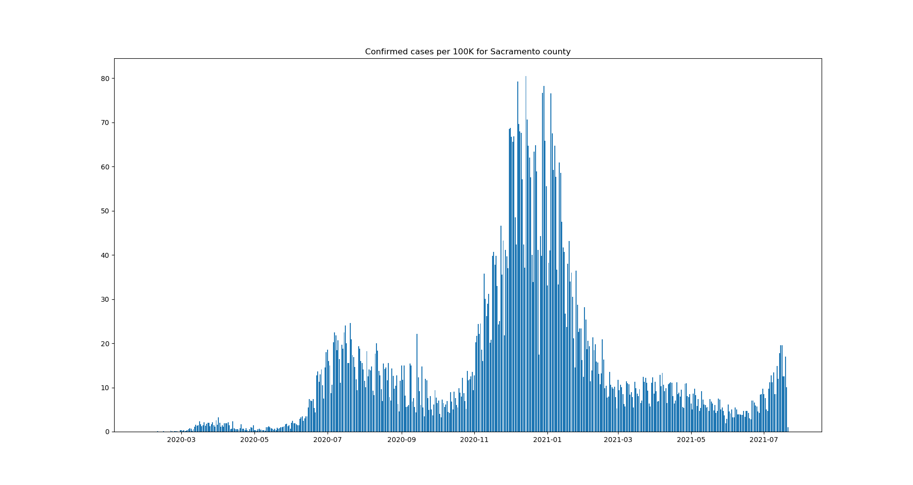

# California COVID-19 Data


This script uses matplotlib to graph confirmed cases per 100K for any California county.

### Data sources
The cases data comes from the CA Open Data Portal
The population data is 2019 estimates from the U.S. Census Bureau

### Requirements
- python 3
- matplotlib

### Usage
```
# specify the county you want to plot data for
# look up the available county names in `statewide_cases.csv`
$ python cases_plot.py "Sacramento"
```



### Updating the data
You can update the data by downloading a new CSV file from https://data.ca.gov/dataset/covid-19-cases and replacing the `statewide_cases.csv` file.
